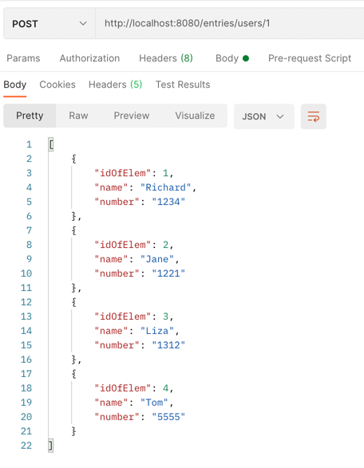

#Задание для компании Dins на вакансию Intern Java Developer 

##Инстркуция по запуску программы

###Запуск программы
``````
mvn spring-boot:run
``````
###Запуск тестов
``````
mvn test
``````

###Список разработанных запросов
Все Rest запросы


###Примеры REST запросов


``````
Get Request
http://localhost:8080/users
``````


``````
Post Request
http://localhost:8080/users
``````


``````
Get Request
http://localhost:8080/users?id=1
``````


``````
Post Request
http://localhost:8080/users/1
``````


``````
Delete Request
http://localhost:8080/users/2
``````


``````
Get Request
http://localhost:8080/users?name="T"
``````


``````
Get Request
http://localhost:8080/entries/1234
``````


``````
Get Request
http://localhost:8080/users/entries/1
``````


``````
Post Request
http://localhost:8080/entries/users/1
``````



``````
Get Request
http://localhost:8080/users/1/entries/2
``````


``````
Delete Request
http://localhost:8080/users/1/entries/2
``````


``````
Put Request
http://localhost:8080/users/1/entries/1
``````

